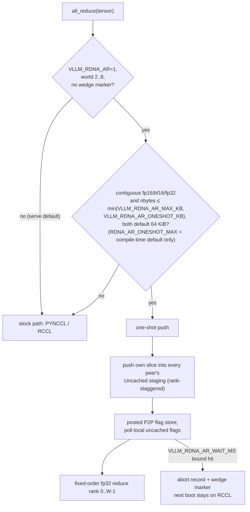

# gfx1030 push one-shot all-reduce (`rdna_ar`) — silicon lock

## Current state at dest tip `38ab87ed` (checked 2026-11-06 ~17:47 Europe/Paris)

Dest: `opengfx1030/vllm-rdna` `rdna_extras` @ `38ab87ed3a854fbd9ecd79b503491b1c97e8dea0` (+11 from watch tip `80059a362c1bd9811e08e90977668a4e18e6652e`). Occupancy still first (FA prefill leftover; this page is interconnect, not FA). Do **not** copy tok/s or µs tables from dest docs.[^38ab-tip][^38ab-cmp]

Silicon in that range: added `csrc/rocm/rdna_allreduce_hier.cuh` (+555); modified `csrc/rocm/rdna_allreduce.cu`, `ops.h`, `torch_bindings.cpp`; host `vllm/distributed/device_communicators/rdna_all_reduce.py` and `vllm/envs.py` (`VLLM_RDNA_AR_HIER` default `"auto"`). Feat bodies: `10ea48449925` (hierarchical path, opt-in) and `2d0f6ccdf9fc` (default `auto`; below `VLLM_RDNA_AR_HIER_MIN_KB` keep the flat one-shot). Tip `38ab87ed` itself is docs-only (tp8/pp2 probe samples); this lock pins against the tip SHA for blobs and the feat SHAs for the HIP bodies.[^38ab-10ea][^38ab-2d0f][^38ab-hier-cuh][^38ab-cu][^38ab-envs]

| Item | At `38ab87ed` |
| --- | --- |
| Hierarchical path | New file `rdna_allreduce_hier.cuh`: 2-level push all-reduce for **K=2** PCIe switch islands of **G** ranks each (world = 2G, G = 2..4; 2×4 on 8-V620). Built on the flat protocol (Uncached IPC staging, posted P2P pushes, flags in each rank's own uncached page, wall-clock-bounded waits / abort record).[^38ab-hier-cuh][^38ab-10ea] |
| Algorithm HIER | reduce-scatter → cross-root exchange of island partials → all-gather; **X** owners per island (local index 0..X−1); every rank ends with bit-identical output. File comment: island partials are rounded to `T`, then the two partials are added (one more rounding than the flat rank-order sum).[^38ab-hier-cuh] |
| Algo ids / size dispatch | `RDNA_AR_ALGO_FLAT=0`, `FLAT_ISL=1`, `HIER=2`. While hier is on, payloads **below** `hier_min_bytes` keep the legacy flat one-shot; from the threshold the size dispatch selects HIER (or `FLAT_ISL` when `VLLM_RDNA_AR_HIER_ALGO=flat` forces the flat exchange with island-grouped arithmetic for diagnostics).[^38ab-hier-algo][^38ab-cu-dispatch][^38ab-2d0f] |
| Launch / LDS / DOT | Hier kernel: `__launch_bounds__(256)`; tiny `__shared__ int s_seq` / `s_abort` only — **not** FA LDS tiles / DOT. No `fdot2` / `sdot4`. Flat path launch remains `<<<nblocks, 256>>>` as before. No CMake gfx1030-only-list change: `rdna_allreduce.cu` stays in base `VLLM_ROCM_EXT_SRC` and `#include`s the hier header.[^38ab-hier-launch][^38ab-cmake] |
| Env | `VLLM_RDNA_AR_HIER` default **`"auto"`** (needs `VLLM_RDNA_AR=1`). Related: `VLLM_RDNA_AR_HIER_MIN_KB` (default **20**), `VLLM_RDNA_AR_HIER_MAX_KB` (default **1024**; `0` = the flat gate), `VLLM_RDNA_AR_HIER_ISLANDS`, `_ALGO`, `_X`, `_BLOCKS`.[^38ab-envs][^38ab-py-hier] |
| `auto` / `1` / `0` | **`auto`**: on for world=8 that forms two equal islands; silent elsewhere. **`1`**: forces any two equal islands of size 2..4 and warns where it cannot. **`0`**: flat exchange. Islands from sysfs PCI path unless `VLLM_RDNA_AR_HIER_ISLANDS` overrides.[^38ab-envs][^38ab-py-doc] |
| Hier flags | After the flat ones in the same 4 KiB flag page: `RDNA_AR_HFLAG_BASE=16`, `RDNA_AR_HFLAG_BLOCKS=32`, phases RS/XR/AG (`RDNA_AR_PH_RS=3`, `PH_XR=4`, `PH_AG=5`).[^38ab-hier-flags] |
| Flat protocol | Still holds for the flat path and for messages below the hier threshold: Uncached staging, VRAM uncached flags, on-device seq, late-peer / lost-write wait (`47c426fb`), vector finisher (`e1ebb1f3`), gather/argmax (`c4a05415`). Serve default for `VLLM_RDNA_AR` remains **`"0"`** / PYNCCL live-safe — hier is **not** the live serve pin.[^38ab-envs-ar0][^47c4-4368] |

*Prior tip sections below (`47c426fb`, `e1ebb1f3`, `c4a05415`, `b7402893`, and the `1dc3bac4` flat baseline) are historical for their SHAs; flat rows that hier does not replace still describe the flat path.*

## Historical: update at dest tip `47c426fb` (checked 2026-11-05; superseded for hier by `38ab87ed`)

`4368ebb5` changes the one-shot wait so a late peer is waited for and only a lost write aborts. Push, Uncached staging, gate, dtypes, finisher and the 256-thread launch are unchanged; no DOT, LDS tile or `__launch_bounds__` change.[^47c4-cmp][^47c4-4368]

| Item | At `47c426fb` |
| --- | --- |
| Wait bound | `RDNA_AR_WAIT_MS` default **600000 ms** (was 120000), set past the engine's 300 s execute timeout, so a rank that has not reached the collective is waited for and a dead rank ends the engine through that timeout. `VLLM_RDNA_AR_WAIT_MS` still overrides. *(Historical @ `1dc3bac4`…`c8727ec4`: 120000 ms; see the Historical flat baseline @ `1dc3bac4` below.)*[^47c4-cuh-wait][^47c4-tuning] |
| Late peer vs lost write | Past `RDNA_AR_SLOW_MS` (2000 ms), once per `RDNA_AR_PROBE_MS` (1000 ms), the waiter does one P2P read of the peer's **own** flag slot (`rdna_ar_peer_announced`). If the peer has announced but our slot is still behind, that is a lost posted write, aborted `RDNA_AR_LOST_MS` (10000 ms) after the announce was first seen.[^47c4-cuh-wait][^47c4-cuh-loop] |
| Announce order | `rdna_ar_announce` stores `seq` into every peer's slot for this rank, starting at `rank+1` and writing this rank's own slot **last**, so seeing the own slot means every store to that peer has left the GPU. MonoKernel Stage D (`mono_k2_rdna2.cu`) now uses the same helper. *(Historical @ `c8727ec4`: plain loop `j = 0..W-1`.)*[^47c4-cuh-announce][^47c4-mono] |
| Sequence wrap | Flags are compared with `rdna_ar_before(flag, seq)` = `(int)((unsigned)flag - (unsigned)seq) < 0` (serial-number order) and `seq` is incremented in unsigned arithmetic; the commit gives the old signed `<` as breaking at the 2^31 wrap (~19 days at ~1300 collectives/s, the commit's own estimate). *(Historical @ `c8727ec4`: `flag < seq`.)*[^47c4-cuh-before][^47c4-4368] |
| Abort / live record | Record byte 0 gains bit 1 (`RDNA_AR_REC_LIVE`, wait still in progress; block 0 refreshes `report[1]` while spinning) and bit 2 (`RDNA_AR_REC_SEEN`, peer had announced). Before aborting, the wave re-reads its flag once, since it may have been descheduled since the last poll. Only a SEEN abort writes the wedge marker that keeps later boots on RCCL.[^47c4-cuh-rec][^47c4-cuh-loop][^47c4-tuning] |
| Root cause given | The dest doc ties the 11-03 / 11-04 wedges to KFD evicting every queue of a worker when host reclaim or compaction moves a page of the 32 GiB userptr-backed pinned PLE table; the fix allocates that table at exact size and `mlock()`s it on gfx10x (`9bd03cfb`). Pinned memory as GTT (`HSA_USERPTR_FOR_PAGED_MEM=0`) was tried and reverted in `7842decc` because the GTT BO landed on another GPU. This page does not copy the doc's timing tables.[^47c4-wedge-doc][^47c4-ple][^47c4-7842] |

## Update at dest tip `e1ebb1f3` (checked 2026-11-03)

`a359ddb4` changes the all-reduce finisher and its launch width. Protocol, gate, dtypes, buffers, wait bound and the 256-thread launch are unchanged.[^e1eb-ar-c]

| Item | State at `e1ebb1f3` |
|---|---|
| Vector finisher | `rdna_ar_sum_vec<T, W>`: one 16-byte load per rank slice, fp32 sum in fixed order rank 0 .. W−1 from `0.f`, one 16-byte store. W is a template argument (2, 4, 8) so the W uncached loads issue back to back. Taken when in/out are 16-byte aligned; the tail and any other world size use the scalar loop. The source says the result is bit-equal to the scalar loop.[^e1eb-ar-vec] |
| Launch width (all-reduce only) | `rdna_ar_reduce_blocks`: 4 / 6 / 32 blocks for staged bytes ≤ 8 KB / ≤ 32 KB / larger, still capped by `VLLM_RDNA_AR_BLOCKS`. Gather and argmax keep `rdna_ar_blocks` (4 / 16 / 32).[^e1eb-ar-blocks] |
| Env | `VLLM_RDNA_AR_VEC` (default **1**); `0` restores the scalar finisher and the old widths.[^e1eb-ar-blocks][^e1eb-ar-tune] |

*Historical @ `c4a05415`:* the all-reduce used the scalar fixed-order loop and `rdna_ar_blocks`, i.e. 16 blocks for 8–32 KB payloads.

## Update at dest tip `c4a05415` (checked 2026-11-02)

`rdna_ar` now also carries two decode-step collectives besides the all-reduce. The all-reduce math, gate, dtypes, buffers and wait bound below are unchanged.[^ar-c4a0-19a0]

| Item | State at `c4a05415` |
|---|---|
| Shared exchange | Phases 1-2 (push into every peer's Uncached staging, posted flag store, local flag wait, abort handling) are one device function, `rdna_ar_exchange`, and each collective is a finisher over it. *(Historical @ `b7402893`: the push and wait lived inline in `rdna_ar_oneshot`.)*[^ar-c4a0-cuh] |
| All-gather | `rdna_ag_oneshot`: last-dim gather, `[rows, cols]` to `[rows, world*cols]` with rank j at columns `[j*cols, (j+1)*cols)`. It is a pure copy, so the result matches RCCL's `all_gather_into_tensor` layout bit for bit.[^ar-c4a0-cuh] |
| Vocab argmax | `rdna_ar_argmax_oneshot`: each rank pushes one 8-byte `(float value, int index)` pair per row (`RdnaArPair`); the finisher keeps `torch.argmax` semantics (NaN wins, ties go to the lowest rank) and writes int64 indices.[^ar-c4a0-cuh] |
| Eligibility | Both use the all-reduce one-shot gate (`rdna_ar_fits`: staged bytes ≤ min(`max_bytes`, `oneshot_max`), so 64 KiB by default). All-gather needs a contiguous fp16/bf16/fp32 tensor; argmax needs 1-D contiguous values plus int64 indices of the same length, sized by `sizeof(RdnaArPair)`.[^ar-c4a0-cu] |
| Launch / LDS | Same launch shape as the all-reduce (`<<<nblocks, 256>>>`, no dynamic LDS); no DOT, no tile, no new `__launch_bounds__`.[^ar-c4a0-cu] |
| Gate | New env `VLLM_RDNA_AR_GATHER`, read with `os.environ` and default `"1"`; `0` keeps all-gather and argmax on RCCL. Both routes also need the backend enabled, and `VLLM_RDNA_AR` still defaults to `"0"`, so a default serve does not take them.[^ar-c4a0-py][^ar-c4a0-envs] |
| Verification claimed | The commit message reports bit-exact results against a reference for worlds 2 and 4 over fp16/bf16/fp32, ties, NaN and CUDA-graph replay on 4x V620. This page does not copy its latency figures.[^ar-c4a0-19a0] |

## Update at dest tip `b7402893` (checked 2026-10-29)

The only `rdna_allreduce.cu` change from `8015ea48` to `b7402893` is the peer-access error order in native init (PR #142). Protocol, gate, dtypes, buffers and wait bound in the next section are unchanged.[^ar-b740-cmp]

| Item | State at `b7402893` |
|---|---|
| Failed peer access | `hipGetLastError()` is now called right after `hipDeviceEnablePeerAccess` and **before** the `TORCH_CHECK` that can throw, "so the RCCL fallback does not inherit a failed peer-access probe". *(Historical @ `1dc3bac4`…`8015ea48`: the clear ran after the check, so it only covered "already enabled"; a real failure threw with the error still in HIP's sticky last-error slot.)*[^ar-b740-cu] |
| How it landed | `b54e6261` first consumed the error from Python via `ctypes` (`libamdhip64.so.7`), with the comment that it "would surface at torch's next launch as `invalid device ordinal` and kill worker init after the graceful disable"; `9aa08d40` moved the fix into the `.cu` and removed the Python workaround (net Python change zero).[^ar-b54e][^ar-9aa0] |
| Silicon impact | None on the kernel: no launch, LDS, Uncached-staging or flag-page change. It only matters when peer access is refused and the backend falls back to RCCL.[^ar-b740-cu] |

## Historical: flat baseline at dest tip `1dc3bac4` (checked 2026-10-11; unchanged at `64d59b89`, rechecked 2026-10-12)

This section supersedes the two-shot and persist-out rows further down; those are kept as history. `csrc/rocm/rdna_allreduce.cu` / `.cuh` have no change from `1dc3bac4` to tip `64d59b89`.[^c-64d59b89-ar]

| Item | State at `1dc3bac4` |
|---|---|
| Algorithm | **One-shot push only.** The two-shot kernel (`rdna_ar_twoshot`) and its selection were removed in `611063c6`: it returned zeros above the one-shot gate and made the boot self-test disable the whole backend. `rdna_ar_can()` also caps at the one-shot gate, so the kernel never sees a larger message.[^c-611063c6][^dest-envs-1dc3][^dest-cuh-1dc3][^dest-py-1dc3] |
| Gate | **Runtime setting: `VLLM_RDNA_AR_ONESHOT_KB`** (KiB, default 64), read by the host at init and by the Python gate; eligible messages are ≤ min(`VLLM_RDNA_AR_MAX_KB`, `VLLM_RDNA_AR_ONESHOT_KB`), both 64 KiB by default; larger messages go to RCCL.[^dest-cu-env-1dc3][^dest-py-gate-1dc3][^dest-envs-1dc3] `RDNA_AR_ONESHOT_MAX` (65536) is a **compile-time constant** in `rdna_allreduce.cuh`: it is only the default that `VLLM_RDNA_AR_ONESHOT_KB` overrides, not a setting you can change at serve time.[^dest-cuh-1dc3] |
| Dtypes | fp16, bf16, fp32 (`at::kHalf`, `at::kFloat`, `at::kBFloat16`).[^dest-envs-1dc3][^dest-cu-elig-1dc3] |
| Recipe gate (`b30757c2`) | The `flashnext-mtp2` recipe sets `VLLM_RDNA_AR_MAX_KB=256` and `VLLM_RDNA_AR_ONESHOT_KB=256` (one-shot up to 256 KiB, RCCL above); commit `641e0c22` raised it from 64 KiB because MTP2 verify batches exceed 64 KiB. The library default `_ONESHOT_DEFAULT_KB` is still 64, and `docs/rdna2/tuning.md` says the other recipes stay at 64 until measured.[^ar-b307-recipe][^ar-b307-py][^ar-b307-tuning] |
| Two-shot requests | `VLLM_RDNA_AR_ALGO=twoshot`, or a `MAX_KB` above the one-shot gate, is ignored with one warning.[^dest-py-1dc3] |
| Output buffer | Each call returns a **fresh output tensor** (`at::empty_like`). Since `00fcc97f` (PR #47), the old shared persistent buffer (`rdna2_persist_zeros`) is gone: it was clobbered by the next all-reduce while callers still held the result (the embedding output kept as the decoder residual).[^extras-rdna-allreduce-cu][^dest-00fcc97f] |
| Wait bound | *(Historical @ `1dc3bac4`…`c8727ec4`; superseded at `47c426fb`, see the update above.)* Each one-shot wait is bounded in wall-clock time by `VLLM_RDNA_AR_WAIT_MS` (default `RDNA_AR_WAIT_MS` = 120000 ms), replacing the old poll-count cap (`VLLM_RDNA_AR_SPIN_CAP` / `RDNA_AR_SPIN_CAP` no longer exist at the tip); waits over `RDNA_AR_SLOW_MS` (2000 ms) that complete are logged as a late peer. This landed in `a43be93b`, which also traced the old "peer flag never arrived" wedge to rank skew rather than a lost P2P write: the 2e6-poll cap was only ~0.8 s on gfx1030. `a43be93b` left two-shot on `SPIN_CAP` polls; `611063c6` then removed two-shot and the `SPIN_CAP` knob.[^dest-cuh-wait-1dc3][^dest-py-1dc3][^c-a43be93b][^c-611063c6] |
| Default | Off: `VLLM_RDNA_AR` defaults to `"0"` and is not implied by `VLLM_FORCE_CUSTOM_ALL_REDUCE`.[^dest-envs-1dc3] |

## Historical: extras lock 2026-09-28 — tip `bfd5286d` (`101a16c8` / prior `22d6e346`+`c782696a`)

Dest: `opengfx1030/vllm-rdna` `rdna_extras`. Occupancy still first (FA prefill leftover). No tok/s.

| Item | Lock |
|---|---|
| `RDNA_AR_ONESHOT_MAX` | **65536** (64 KiB) compile-time default in `csrc/rocm/rdna_allreduce.cuh` — was 32768; env-less callers stay one-shot ≤ 64 KiB. Runtime override is `VLLM_RDNA_AR_ONESHOT_KB` (still true at `1dc3bac4`). [^dest-cuh-1dc3][^dest-cu-env-1dc3] |
| Default path | *(historical; two-shot removed in `611063c6`, first locked at `1dc3bac4`)*[^c-611063c6] One-shot ≤ 64 KiB, RCCL above. Two-shot only if explicitly opted in (wide `VLLM_RDNA_AR_MAX_KB` without matching oneshot / algo override). Serve scripts + library `max_kb` default back to **64**. |
| Two-shot kernel | *(historical; removed in `611063c6`, first locked at `1dc3bac4`)*[^c-611063c6] Was present (`rdna_ar_twoshot`: push reduce-scatter + allgather, abort phases 3/4, bf16, flag row `RDNA_AR_FLAG_STRIDE`). |
| Two-shot race | *(historical; kernel removed in `611063c6`, first locked at `1dc3bac4`)*[^c-611063c6] Peer-flag handshake wedges under co-tenant PCIe load (`rdna_ar_check` / wedge marker → RCCL). **Later/rework** — not dest-safe. Do not re-arm wide gate until phases 2/4 fixed. |
| Gate | Still opt-in `VLLM_RDNA_AR=1`; serve default stays PYNCCL. No DOT / FA `__launch_bounds__` / LDS tile. |

Prior protocol lock (Uncached staging, VRAM flags, on-device seq, T44b abort, push fanout) below still holds for the one-shot path.

---

Date: **2026-09-18**. Dest tip: `opengfx1030/vllm-rdna` `rdna_extras` @ `3b59ee16` (PR #13 leap T44b). Prior silicon lock tip: `a4060647`. Occupancy still first (FA prefill leftover). Do **not** copy tok/s.[^commit-3b59ee16][^commit-a4060647]

Companions: [rccl-p2p.md](rccl-p2p.md) (why stock custom AR is off), [leapdragon.md](../external-projects/leapdragon.md) (push vs pull GB/s, Uncached), [graph-capture.md](../hip-craft/graph-capture.md) (no frozen seq in kernarg), [plx-p2p-mmio.md](plx-p2p-mmio.md) (root-complex burst / fabric knobs).

## Status

| Item | Lock |
|---|---|
| Files | `csrc/rocm/rdna_allreduce.cuh` (flat kernels), `csrc/rocm/rdna_allreduce_hier.cuh` (hier kernels @ `38ab87ed`), `csrc/rocm/rdna_allreduce.cu` (host), `ops.h` / `torch_bindings.cpp`, `vllm/distributed/device_communicators/rdna_all_reduce.py`, hook in `cuda_communicator.py` [^38ab-hier-cuh][^extras-rdna-allreduce-cu][^extras-rdna-all-reduce-py] |
| CMake | `rdna_allreduce.cu` in base `VLLM_ROCM_EXT_SRC` (not the gfx1030-only append list); hier is a `.cuh` include — no new CMake gfx1030-list entry at `38ab87ed`.[^38ab-cmake] |
| Gate | **Opt-in.** `VLLM_RDNA_AR=1` + world 2..8. Default env remains `"0"`. Serve default stays PYNCCL / stock path; `VLLM_FORCE_CUSTOM_ALL_REDUCE` does **not** arm this. Hier (`VLLM_RDNA_AR_HIER`, default `auto`) only applies when AR is already armed and the group is two equal islands.[^38ab-envs][^38ab-envs-ar0] |
| Attribution | Protocol / abort-record / wedge marker from leapdragon/vllm-rdna2-qwen T44/T44b (Aron Hsiao). Persist-out (`rdna2_persist_zeros`; *historical*, replaced by a fresh output per call in `00fcc97f`), integer device index, PIX logging, default-off are this fork. Hier path is this fork (`10ea4844` / `2d0f6ccd`).[^38ab-10ea][^38ab-2d0f] |
| DOT / LDS / launch_bounds | **None of the FA leftover.** Tiny `__shared__ int` only (seq + abort) on flat and hier. No `fdot2` / `sdot4`, no tile pad. Hier adds `__launch_bounds__(256)` on `rdna_ar_hier` only (still not an FA occupancy gate).[^38ab-hier-launch] |

## Protocol (T44b @ tip `3b59ee16`)

Keeps the WS2 / leapdragon findings, with the 2026-08-30 / T44b flag + abort updates:

1. **Push, never pull** — each rank writes its slice into every peer’s staging slot (`src = our rank`). Peer order is rank-staggered: `j = (rank + k) % world`.
2. **Staging is Uncached** — `hipExtMallocWithFlags(..., hipDeviceMallocUncached)`. Coarse-grained peer stores otherwise leave the owner reading stale L2.
3. **Flags live in each rank’s OWN uncached device memory** — 4 KiB flag page appended to the same Uncached staging alloc (`RDNA_AR_FLAG_PAGE`). Peer announce is one posted P2P store into `peers.flags[j][rank]`; we poll **local** uncached slots (no PCIe read traffic on the wait). Host-coherent `shm_open` flag page is **gone** (signature keeps `shm_name` but ignores it).[^m-78e84a272cf-csrc-rocm-rdna-allreduce-cuh]
4. **Seq on-device** — `seqbuf` atomic load+1 inside the kernel; never a kernarg (graph-capture safe). Dual parity staging: `stage[(parity * W + src) * max_elems + i]`.
5. **Bounded wait + T44b abort record** — *(historical at `3b59ee16`: `VLLM_RDNA_AR_SPIN_CAP`, default `RDNA_AR_SPIN_CAP` 2e6 polls; neither name exists at `1dc3bac4`, where the bound is wall-clock `VLLM_RDNA_AR_WAIT_MS`, default 120000 ms[^dest-cuh-wait-1dc3])*; first block to hit the bound `atomicCAS`es device `timeout` and writes a 64-bit code into a **host-mapped** `report` (plain store, no PCIe atomics). Python `rdna_ar_timeout_info` / `rdna_ar_check()` read with a plain host load (no D2H sync). Poll backoff: `__builtin_amdgcn_s_sleep(8)`. (ISA: ≈ 448–512 clocks out of arbitration; slot stays reserved — [wave-priority-occupancy.md](../occupancy/wave-priority-occupancy.md).)
6. **Wedge marker** — on abort, write `VLLM_CACHE_ROOT/rdna_ar_wedged` and fail the step; next boot stays on RCCL until the marker is deleted.
7. **Fixed-order fp32 reduce** — rank 0 .. W−1 accumulate in `float`, then store `T` (`half` or `float`). Bit-identical across ranks for TP.

Abort code layout (bits) at `1dc3bac4`: `0-7` aborted flag; `8-11` phase (`1` = own grid barrier, `2` = peer flag missing); `12-15` peer; `16-31` measured wall-clock wait in 16 ms units (saturating); `32-63` sequence. *(At `3b59ee16`, bits 16-31 were spins/1024, labelled "~ms"; historical.)*[^dest-cuh-abort-1dc3]

World max: `RDNA_AR_MAX_WORLD = 8`. Launch: **256** threads[^dest-cu-launch-1dc3]; blocks auto by payload size, capped by `VLLM_RDNA_AR_BLOCKS`. `VLLM_RDNA_AR_PACE` (0..127) paces strided pushes. `VLLM_RDNA_AR_MAX_KB` default **64** (decode-sized; prefill stays on RCCL/CUSTOM).

Eligibility at `1dc3bac4`: contiguous fp16 / bf16 / fp32, `nbytes ≤` the one-shot gate (min of `VLLM_RDNA_AR_MAX_KB` and `VLLM_RDNA_AR_ONESHOT_KB`).[^dest-cu-elig-1dc3][^dest-py-gate-1dc3] Larger / other dtypes stay on stock RCCL path. When armed, eligible tensors dispatch **ahead of** stock CUSTOM / PYNCCL.

```mermaid
flowchart TB
  T["all_reduce(tensor)"] --> G{"VLLM_RDNA_AR=1,<br/>world 2..8,<br/>no wedge marker?"}
  G -- "no (serve default)" --> R["stock path: PYNCCL / RCCL"]
  G -- "yes" --> E{"contiguous fp16/bf16/fp32<br/>and nbytes ≤ min(VLLM_RDNA_AR_MAX_KB,<br/>VLLM_RDNA_AR_ONESHOT_KB), both default 64 KiB?<br/>(RDNA_AR_ONESHOT_MAX = compile-time default only)"}
  E -- "no" --> R
  E -- "yes" --> O["one-shot push"]
  O --> P1["push own slice into every peer's<br/>Uncached staging (rank-staggered)"]
  P1 --> P2["posted P2P flag store;<br/>poll local uncached flags"]
  P2 --> P3["fixed-order fp32 reduce rank 0..W-1"]
  P2 -- "VLLM_RDNA_AR_WAIT_MS bound hit" --> AB["abort record + wedge marker<br/>next boot stays on RCCL"]
```

*Diagram (historical for flat-only dispatch @ `1dc3bac4`): one-shot push when `VLLM_RDNA_AR=1` and nbytes ≤ the one-shot gate; RCCL above. At `38ab87ed`, when hier is on for two equal islands, messages at/above `VLLM_RDNA_AR_HIER_MIN_KB` take the HIER path (RS→XR→AG) instead of this flat one-shot; below the threshold the flat one-shot above still runs. Two-shot no longer exists.*[^extras-rdna-allreduce-cu][^commit-3b59ee16][^dest-cuh-1dc3][^38ab-cu-dispatch]

## What this is not

- Not a replacement for FA occupancy work.
- Not the production default on V620 TP=4 PIX — leave `VLLM_RDNA_AR=0`; PYNCCL remains the dest-safe Uncached-P2P backend for mixed prefill/decode. Hier `auto` does not arm TP4 (world≠8); do not treat hier as the live serve pin even on TP8.[^38ab-envs-ar0][^38ab-py-doc]
- Not XGMI / Instinct custom AR; vLLM’s gfx94/95 custom + QuickReduce stay off on V620 ([rccl-p2p.md](rccl-p2p.md)).
- Do not paste T44 µs figures or leapdragon tok/s into dest claims; cite source comments only when needed, and keep our own benches separate.

## Take / Leave

| | |
|---|---|
| **Take** | Uncached staging + **VRAM uncached flags** + on-device seq + push fanout + fixed-order reduce + T44b host-mapped abort record / `rdna_ar_check()` / wedge marker. Fabric knobs (`BLOCKS` / `PACE`; wall-clock `WAIT_MS` replaced `SPIN_CAP`). Library default `MAX_KB=64` (the `flashnext-mtp2` recipe sets 256 since `641e0c22`, locked at `b30757c2`[^ar-b307-recipe]). Fresh output per call (persist-out is historical since `00fcc97f`). **Take Later:** hierarchical RS→XR→AG for TP8 two-island topology when `VLLM_RDNA_AR=1` and islands classify (`38ab87ed` / `10ea4844` / `2d0f6ccd`).[^38ab-hier-cuh][^38ab-10ea] |
| **Leave** | Default-on for `VLLM_RDNA_AR` (still `"0"`); default-on hier for TP4 / non-island worlds; claiming hier is the live serve pin; host-coherent flag page; mid-serve silent spin-to-cap without wedge fail; any claimed µs/GB/s or tok/s from dest hier docs until remeasured on this box; auto-arming because P2P is on.[^38ab-envs-ar0] |

## Sources

- opengfx1030/vllm-rdna tip `38ab87ed3a854fbd9ecd79b503491b1c97e8dea0` (read 2026-11-06 Europe/Paris): `rdna_allreduce_hier.cuh`, `rdna_allreduce.cu`, `vllm/envs.py`, `rdna_all_reduce.py`; feat commits `10ea48449925`, `2d0f6ccdf9fc`; compare `80059a36...38ab87ed`
- opengfx1030/vllm-rdna tip `47c426fb43bfadf161d97536262408afb442924a` (read 2026-11-05): `rdna_allreduce.cuh`, `mono_k2_rdna2.cu`, commits `4368ebb5`, `9bd03cfb`, `7842decc`, `docs/rdna2/rdna-ar-wedge-2026-11-04.md`, `docs/rdna2/tuning.md`
- opengfx1030/vllm-rdna commits `611063c6` (two-shot removal), `a43be93b` (wall-clock one-shot wait), `00fcc97f` (fresh output); tip `64d59b89` (read 2026-10-12)

Primary sources for this page, cited inline as footnotes:

[^extras-rdna-allreduce-cu]: `csrc/rocm/rdna_allreduce.cu`, opengfx1030/vllm-rdna rdna_extras at 1dc3bac4 (2026-10-11 tip); the page may describe an older commit named inline. https://github.com/opengfx1030/vllm-rdna/blob/1dc3bac4cda3201a1b4fb345e044578e84a272cf/csrc/rocm/rdna_allreduce.cu
[^commit-3b59ee16]: opengfx1030/vllm-rdna commit `3b59ee16e553`. https://github.com/opengfx1030/vllm-rdna/commit/3b59ee16e553168b1e3809c9a141088662171448 (exists, verified via GitHub API 2026-10-11)
[^commit-a4060647]: opengfx1030/vllm-rdna commit `a4060647cfbb`. https://github.com/opengfx1030/vllm-rdna/commit/a4060647cfbb32d3b907eba6018501bb8b251d22 (exists, verified via GitHub API 2026-10-11)
[^extras-rdna-all-reduce-py]: `vllm/distributed/device_communicators/rdna_all_reduce.py`, opengfx1030/vllm-rdna rdna_extras at 1dc3bac4 (2026-10-11 tip); the page may describe an older commit named inline. https://github.com/opengfx1030/vllm-rdna/blob/1dc3bac4cda3201a1b4fb345e044578e84a272cf/vllm/distributed/device_communicators/rdna_all_reduce.py
[^m-78e84a272cf-csrc-rocm-rdna-allreduce-cuh]: github.com/opengfx1030/vllm-rdna/blob/1dc3bac4cda3201a1b4fb345e044578e84a272cf/csrc/rocm/rdna_allreduce.cuh. https://github.com/opengfx1030/vllm-rdna/blob/1dc3bac4cda3201a1b4fb345e044578e84a272cf/csrc/rocm/rdna_allreduce.cuh (checked 2026-10-11)
[^dest-envs-1dc3]: `vllm/envs.py`, `VLLM_RDNA_AR` comment block, opengfx1030/vllm-rdna at 1dc3bac4. https://github.com/opengfx1030/vllm-rdna/blob/1dc3bac4cda3201a1b4fb345e044578e84a272cf/vllm/envs.py#L1469-L1476
[^dest-cuh-1dc3]: `csrc/rocm/rdna_allreduce.cuh`, `RDNA_AR_ONESHOT_MAX` and its comment, opengfx1030/vllm-rdna at 1dc3bac4. https://github.com/opengfx1030/vllm-rdna/blob/1dc3bac4cda3201a1b4fb345e044578e84a272cf/csrc/rocm/rdna_allreduce.cuh#L58-L70
[^dest-py-1dc3]: `vllm/distributed/device_communicators/rdna_all_reduce.py` module docstring, opengfx1030/vllm-rdna at 1dc3bac4. https://github.com/opengfx1030/vllm-rdna/blob/1dc3bac4cda3201a1b4fb345e044578e84a272cf/vllm/distributed/device_communicators/rdna_all_reduce.py#L15-L30
[^dest-00fcc97f]: opengfx1030/vllm-rdna commit 00fcc97f "fix(rocm): rdna_ar returns a fresh output tensor per all-reduce" (PR #47; an ancestor of 1dc3bac4). https://github.com/opengfx1030/vllm-rdna/commit/00fcc97ff5015158da93f52bd32f2c70757f0f8a
[^dest-cu-env-1dc3]: `csrc/rocm/rdna_allreduce.cu` `getenv("VLLM_RDNA_AR_ONESHOT_KB")` overriding `oneshot_max = RDNA_AR_ONESHOT_MAX`, opengfx1030/vllm-rdna at 1dc3bac4. https://github.com/opengfx1030/vllm-rdna/blob/1dc3bac4cda3201a1b4fb345e044578e84a272cf/csrc/rocm/rdna_allreduce.cu#L84-L93
[^dest-py-gate-1dc3]: `resolve_gate_kb()` in `vllm/distributed/device_communicators/rdna_all_reduce.py` (`VLLM_RDNA_AR_ONESHOT_KB`, `_ONESHOT_DEFAULT_KB = 64`), opengfx1030/vllm-rdna at 1dc3bac4. https://github.com/opengfx1030/vllm-rdna/blob/1dc3bac4cda3201a1b4fb345e044578e84a272cf/vllm/distributed/device_communicators/rdna_all_reduce.py#L52-L80
[^dest-cuh-wait-1dc3]: `RDNA_AR_WAIT_MS` / `RDNA_AR_SLOW_MS` and their comment in `csrc/rocm/rdna_allreduce.cuh`, opengfx1030/vllm-rdna at 1dc3bac4. https://github.com/opengfx1030/vllm-rdna/blob/1dc3bac4cda3201a1b4fb345e044578e84a272cf/csrc/rocm/rdna_allreduce.cuh#L51-L65
[^dest-cuh-abort-1dc3]: abort-record comment and `rdna_ar_ms_code` in `csrc/rocm/rdna_allreduce.cuh`, opengfx1030/vllm-rdna at 1dc3bac4. https://github.com/opengfx1030/vllm-rdna/blob/1dc3bac4cda3201a1b4fb345e044578e84a272cf/csrc/rocm/rdna_allreduce.cuh#L72-L96
[^dest-cu-launch-1dc3]: `rdna_ar_oneshot<T><<<nblocks, 256, 0, stream>>>` in `csrc/rocm/rdna_allreduce.cu`, opengfx1030/vllm-rdna at 1dc3bac4. https://github.com/opengfx1030/vllm-rdna/blob/1dc3bac4cda3201a1b4fb345e044578e84a272cf/csrc/rocm/rdna_allreduce.cu#L196
[^dest-cu-elig-1dc3]: dtype check (`kHalf` / `kFloat` / `kBFloat16`) and `at::empty_like` output in `csrc/rocm/rdna_allreduce.cu`, opengfx1030/vllm-rdna at 1dc3bac4. https://github.com/opengfx1030/vllm-rdna/blob/1dc3bac4cda3201a1b4fb345e044578e84a272cf/csrc/rocm/rdna_allreduce.cu#L215-L231
[^c-611063c6]: opengfx1030/vllm-rdna commit [`611063c6`](https://github.com/opengfx1030/vllm-rdna/commit/611063c62a400ba96e15e8168e2b2418494fdfdd) (2026-10-09) — "fix(rdna): remove the two-shot all-reduce from rdna_ar". Deletes `rdna_ar_twoshot`, `VLLM_RDNA_AR_ALGO` twoshot selection and `RDNA_AR_SPIN_CAP` / `VLLM_RDNA_AR_SPIN_CAP`; message: two-shot "returned zeros above the one-shot gate", `twoshot` / larger `MAX_KB` "ignored with one warning", `rdna_ar_can()` caps at the one-shot gate.
[^c-a43be93b]: opengfx1030/vllm-rdna commit [`a43be93b`](https://github.com/opengfx1030/vllm-rdna/commit/a43be93b10f921bae65e047b23d4ba1d33d6aa44) (2026-10-09) — "fix(rdna): rdna_ar one-shot waits tolerate late peers (wall-clock bound)". Message: root cause is rank skew; the 2e6-poll cap "on gfx1030 is only ~0.8 s"; waits use `wall_clock64` at `hipDeviceAttributeWallClockRate`; `VLLM_RDNA_AR_WAIT_MS` default 120 s; "Two-shot is untouched (still VLLM_RDNA_AR_SPIN_CAP polls)". An ancestor of `611063c6`.
[^c-64d59b89-ar]: opengfx1030/vllm-rdna tip [`64d59b89`](https://github.com/opengfx1030/vllm-rdna/commit/64d59b8942d3b982f1d91f0f3e625dfda4418106); `git diff --stat 1dc3bac4cda3201a1b4fb345e044578e84a272cf 64d59b8942d3b982f1d91f0f3e625dfda4418106 -- csrc` lists only `csrc/rocm/moe_w4a8_rdna2.cu`.
[^ar-b740-cmp]: Compare [`8015ea48...b7402893`](https://github.com/opengfx1030/vllm-rdna/compare/8015ea485b7f6c0298d8f98ce6e824ce1c444c45...b74028935393d1e21f73f80f65f506c9ea4639af): `csrc/rocm/rdna_allreduce.cu` +3/−4 lines, `.cuh` unchanged; PR #142 merged as [`03287a53`](https://github.com/opengfx1030/vllm-rdna/commit/03287a53f0b895be66adef219c1e8ed97035ed81).
[^ar-b740-cu]: [rdna_allreduce.cu:114–125](https://github.com/opengfx1030/vllm-rdna/blob/b74028935393d1e21f73f80f65f506c9ea4639af/csrc/rocm/rdna_allreduce.cu#L114-L125) @ b74028935393d1e21f73f80f65f506c9ea4639af.
[^ar-b54e]: Commit [`b54e6261`](https://github.com/opengfx1030/vllm-rdna/commit/b54e626104e248be16eb59ffe916116170a069f9) "fix(rdna2): consume HIP sticky error after failed peer-access enable" (`vllm/distributed/device_communicators/rdna_all_reduce.py` +10).
[^ar-9aa0]: Commit [`9aa08d40`](https://github.com/opengfx1030/vllm-rdna/commit/9aa08d40a66b180ca61ee1133e464618a0b0a463) "fix(rdna2): clear peer-access error before native init throws" (`rdna_allreduce.cu` +3/−4, `rdna_all_reduce.py` −10).
[^ar-c4a0-19a0]: opengfx1030/vllm-rdna commit [`19a010b4`](https://github.com/opengfx1030/vllm-rdna/commit/19a010b476a82455aa3b54ef63b91f6e5fa9d3f4) (2026-11-01) "feat(rdna2): HIP one-shot all-gather and fused vocab argmax on rdna_ar"; an ancestor of dest tip `c4a05415cbda030c784bdc91c7d32e55c287a828`.
[^ar-c4a0-cuh]: `csrc/rocm/rdna_allreduce.cuh` L198 (`rdna_ar_exchange`), L334 (all-reduce finisher), L360-L388 (`rdna_ag_oneshot`), L392-L440 (`RdnaArPair`, `rdna_ar_pair_wins`, `rdna_ar_argmax_oneshot`) @ c4a05415cbda030c784bdc91c7d32e55c287a828. https://github.com/opengfx1030/vllm-rdna/blob/c4a05415cbda030c784bdc91c7d32e55c287a828/csrc/rocm/rdna_allreduce.cuh#L198-L440
[^ar-c4a0-cu]: `csrc/rocm/rdna_allreduce.cu` L281-L282 (`rdna_ar_fits`), L286-L304 (launches, 256 threads), L311-L316 (`rdna_ar_can_all_gather`), L353-L362 (`rdna_ar_can_argmax`) @ c4a05415cbda030c784bdc91c7d32e55c287a828. https://github.com/opengfx1030/vllm-rdna/blob/c4a05415cbda030c784bdc91c7d32e55c287a828/csrc/rocm/rdna_allreduce.cu#L281-L362
[^ar-c4a0-py]: `vllm/distributed/device_communicators/rdna_all_reduce.py` L150-L152 (`VLLM_RDNA_AR_GATHER`, default "1") @ c4a05415cbda030c784bdc91c7d32e55c287a828. https://github.com/opengfx1030/vllm-rdna/blob/c4a05415cbda030c784bdc91c7d32e55c287a828/vllm/distributed/device_communicators/rdna_all_reduce.py#L150-L152
[^ar-c4a0-envs]: `vllm/envs.py` L184 and L1511 (`VLLM_RDNA_AR` default "0") @ c4a05415cbda030c784bdc91c7d32e55c287a828. https://github.com/opengfx1030/vllm-rdna/blob/c4a05415cbda030c784bdc91c7d32e55c287a828/vllm/envs.py#L1511

[^ar-b307-recipe]: `tools/rdna/recipes/flashnext-mtp2.env` @ `b30757c2` (L38-L44): https://github.com/opengfx1030/vllm-rdna/blob/b30757c257c25c737d671179025bbc5c2ec1ee50/tools/rdna/recipes/flashnext-mtp2.env#L38-L44 ; commit [`641e0c22`](https://github.com/opengfx1030/vllm-rdna/commit/641e0c2288db9aae34b74428632b80bc8643adfb) "perf(rdna2): flashnext-mtp2 one-shot all-reduce gate 64 -> 256 KiB" (in compare https://github.com/opengfx1030/vllm-rdna/compare/59b0f5eb227998194c5ac8ca7bebf555f1e8ae32...b30757c257c25c737d671179025bbc5c2ec1ee50).
[^ar-b307-py]: `_ONESHOT_DEFAULT_KB = 64` and `resolve_gate_kb()` @ `b30757c2`: https://github.com/opengfx1030/vllm-rdna/blob/b30757c257c25c737d671179025bbc5c2ec1ee50/vllm/distributed/device_communicators/rdna_all_reduce.py#L58-L80
[^ar-b307-tuning]: `docs/rdna2/tuning.md` all-reduce env table @ `b30757c2`: https://github.com/opengfx1030/vllm-rdna/blob/b30757c257c25c737d671179025bbc5c2ec1ee50/docs/rdna2/tuning.md

[^e1eb-ar-c]: opengfx1030/vllm-rdna commit [`a359ddb4`](https://github.com/opengfx1030/vllm-rdna/commit/a359ddb4a8f483ffb6690b057c70c11c68718734) "rdna_ar: 16-byte all-reduce finisher, retuned launch widths"; tip [`e1ebb1f3`](https://github.com/opengfx1030/vllm-rdna/commit/e1ebb1f3fa6bebe8822036b12f03da6220b611a6)
[^e1eb-ar-vec]: `rdna_ar_sum_vec` and the finisher dispatch in `rdna_ar_oneshot` @ `e1ebb1f3`: https://github.com/opengfx1030/vllm-rdna/blob/e1ebb1f3fa6bebe8822036b12f03da6220b611a6/csrc/rocm/rdna_allreduce.cuh#L319-L410
[^e1eb-ar-blocks]: `VLLM_RDNA_AR_VEC` parse, `rdna_ar_blocks`, `rdna_ar_reduce_blocks` and the all-reduce call site @ `e1ebb1f3`: https://github.com/opengfx1030/vllm-rdna/blob/e1ebb1f3fa6bebe8822036b12f03da6220b611a6/csrc/rocm/rdna_allreduce.cu#L56-L58 ; https://github.com/opengfx1030/vllm-rdna/blob/e1ebb1f3fa6bebe8822036b12f03da6220b611a6/csrc/rocm/rdna_allreduce.cu#L104-L105 ; https://github.com/opengfx1030/vllm-rdna/blob/e1ebb1f3fa6bebe8822036b12f03da6220b611a6/csrc/rocm/rdna_allreduce.cu#L232-L253 ; https://github.com/opengfx1030/vllm-rdna/blob/e1ebb1f3fa6bebe8822036b12f03da6220b611a6/csrc/rocm/rdna_allreduce.cu#L276-L277
[^e1eb-ar-tune]: `VLLM_RDNA_AR_VEC` row in `docs/rdna2/tuning.md` @ `e1ebb1f3`: https://github.com/opengfx1030/vllm-rdna/blob/e1ebb1f3fa6bebe8822036b12f03da6220b611a6/docs/rdna2/tuning.md#L426

[^47c4-cmp]: Compare [`c8727ec4...47c426fb`](https://github.com/opengfx1030/vllm-rdna/compare/c8727ec4a8101f1e7ef607e2ea02c7098dc23e62...47c426fb43bfadf161d97536262408afb442924a): the only `csrc/` files touched are `csrc/rocm/rdna_allreduce.cuh` (+124/−49) and `csrc/rocm/mono_k2_rdna2.cu` (+8/−8).
[^47c4-4368]: opengfx1030/vllm-rdna commit [`4368ebb5`](https://github.com/opengfx1030/vllm-rdna/commit/4368ebb5d86c192faabdc7e4088fff496c0f70ef) "fix(rdna): rdna_ar waits out a late peer and aborts only a lost write" (message: 120 s to 600 s, probe past 2 s once a second, lost-write abort 10 s after announce seen, serial-number compare for the 2^31 wrap).
[^47c4-cuh-wait]: `RDNA_AR_WAIT_MS` / `_SLOW_MS` / `_PROBE_MS` / `_LOST_MS` and their comment, `csrc/rocm/rdna_allreduce.cuh` at 47c426fb. https://github.com/opengfx1030/vllm-rdna/blob/47c426fb43bfadf161d97536262408afb442924a/csrc/rocm/rdna_allreduce.cuh#L52-L81
[^47c4-cuh-rec]: Abort-record layout, `RDNA_AR_REC_LIVE` / `RDNA_AR_REC_SEEN`, `csrc/rocm/rdna_allreduce.cuh` at 47c426fb. https://github.com/opengfx1030/vllm-rdna/blob/47c426fb43bfadf161d97536262408afb442924a/csrc/rocm/rdna_allreduce.cuh#L100-L120
[^47c4-cuh-before]: `rdna_ar_before`, `csrc/rocm/rdna_allreduce.cuh` at 47c426fb. https://github.com/opengfx1030/vllm-rdna/blob/47c426fb43bfadf161d97536262408afb442924a/csrc/rocm/rdna_allreduce.cuh#L134-L139
[^47c4-cuh-announce]: `rdna_ar_announce` and `rdna_ar_peer_announced`, `csrc/rocm/rdna_allreduce.cuh` at 47c426fb. https://github.com/opengfx1030/vllm-rdna/blob/47c426fb43bfadf161d97536262408afb442924a/csrc/rocm/rdna_allreduce.cuh#L211-L230
[^47c4-cuh-loop]: Wait loop in `rdna_ar_exchange` (probe, lost test, re-read before abort, live record), `csrc/rocm/rdna_allreduce.cuh` at 47c426fb. https://github.com/opengfx1030/vllm-rdna/blob/47c426fb43bfadf161d97536262408afb442924a/csrc/rocm/rdna_allreduce.cuh#L325-L380
[^47c4-mono]: MonoKernel Stage D announce and wait, `csrc/rocm/mono_k2_rdna2.cu` at 47c426fb. https://github.com/opengfx1030/vllm-rdna/blob/47c426fb43bfadf161d97536262408afb442924a/csrc/rocm/mono_k2_rdna2.cu#L2020-L2040
[^47c4-tuning]: `VLLM_RDNA_AR_WAIT_MS` row, `docs/rdna2/tuning.md` at 47c426fb. https://github.com/opengfx1030/vllm-rdna/blob/47c426fb43bfadf161d97536262408afb442924a/docs/rdna2/tuning.md#L428
[^47c4-wedge-doc]: `docs/rdna2/rdna-ar-wedge-2026-11-04.md` at 47c426fb. https://github.com/opengfx1030/vllm-rdna/blob/47c426fb43bfadf161d97536262408afb442924a/docs/rdna2/rdna-ar-wedge-2026-11-04.md
[^47c4-ple]: commit [`9bd03cfb`](https://github.com/opengfx1030/vllm-rdna/commit/9bd03cfb9baee5a4638516eb269913a15103eb83) "fix(rdna): mlock the exact-size pinned PLE table on gfx10x"; code in https://github.com/opengfx1030/vllm-rdna/blob/47c426fb43bfadf161d97536262408afb442924a/vllm/models/qwen4_exp/common/ngram_embedding.py#L839-L870
[^47c4-7842]: commit [`7842decc`](https://github.com/opengfx1030/vllm-rdna/commit/7842decc7efa2e65d291e9827656133941d0754b) "revert(rdna): drop GTT host memory for workers; GTT BOs land on a foreign GPU".

[^38ab-tip]: opengfx1030/vllm-rdna tip [`38ab87ed`](https://github.com/opengfx1030/vllm-rdna/commit/38ab87ed3a854fbd9ecd79b503491b1c97e8dea0) "docs(rdna2): tp8/pp2 40-run probe samples … [skip ci]" (docs-only tip; parent of HIP bodies is the feat range below).
[^38ab-cmp]: Compare [`80059a36...38ab87ed`](https://github.com/opengfx1030/vllm-rdna/compare/80059a362c1bd9811e08e90977668a4e18e6652e...38ab87ed3a854fbd9ecd79b503491b1c97e8dea0): +11 commits; silicon adds `csrc/rocm/rdna_allreduce_hier.cuh` (+555) and modifies `rdna_allreduce.cu` / `ops.h` / `torch_bindings.cpp` plus host envs and `rdna_all_reduce.py`.
[^38ab-10ea]: opengfx1030/vllm-rdna commit [`10ea484499250ed7dca1f5065ef1d7528af84139`](https://github.com/opengfx1030/vllm-rdna/commit/10ea484499250ed7dca1f5065ef1d7528af84139) "feat(rdna-ar): hierarchical all-reduce for two PCIe switch islands (opt-in)".
[^38ab-2d0f]: opengfx1030/vllm-rdna commit [`2d0f6ccdf9fc0928a93a79198085beb5580e053c`](https://github.com/opengfx1030/vllm-rdna/commit/2d0f6ccdf9fc0928a93a79198085beb5580e053c) "feat(rdna-ar): hier mode defaults to auto; below VLLM_RDNA_AR_HIER_MIN_KB keep the flat one-shot".
[^38ab-hier-cuh]: `csrc/rocm/rdna_allreduce_hier.cuh` file comment + algo / flag defines + `rdna_ar_hier` @ tip `38ab87ed`. https://github.com/opengfx1030/vllm-rdna/blob/38ab87ed3a854fbd9ecd79b503491b1c97e8dea0/csrc/rocm/rdna_allreduce_hier.cuh
[^38ab-hier-algo]: `RDNA_AR_ALGO_FLAT` / `FLAT_ISL` / `HIER` defines, `csrc/rocm/rdna_allreduce_hier.cuh` L66-L68 @ `38ab87ed`. https://github.com/opengfx1030/vllm-rdna/blob/38ab87ed3a854fbd9ecd79b503491b1c97e8dea0/csrc/rocm/rdna_allreduce_hier.cuh#L66-L68
[^38ab-hier-flags]: `RDNA_AR_HFLAG_BASE` / `HFLAG_BLOCKS` / `HPHASES` / `PH_RS`/`PH_XR`/`PH_AG`, `csrc/rocm/rdna_allreduce_hier.cuh` L53-L63 @ `38ab87ed`. https://github.com/opengfx1030/vllm-rdna/blob/38ab87ed3a854fbd9ecd79b503491b1c97e8dea0/csrc/rocm/rdna_allreduce_hier.cuh#L53-L63
[^38ab-hier-launch]: `rdna_ar_hier` `__launch_bounds__(256)` and `__shared__ int s_seq` / `s_abort`, `csrc/rocm/rdna_allreduce_hier.cuh` L322-L330 @ `38ab87ed`. https://github.com/opengfx1030/vllm-rdna/blob/38ab87ed3a854fbd9ecd79b503491b1c97e8dea0/csrc/rocm/rdna_allreduce_hier.cuh#L322-L330
[^38ab-cu]: `csrc/rocm/rdna_allreduce.cu` hier state + `#include "rdna_allreduce_hier.cuh"` @ tip `38ab87ed`. https://github.com/opengfx1030/vllm-rdna/blob/38ab87ed3a854fbd9ecd79b503491b1c97e8dea0/csrc/rocm/rdna_allreduce.cu
[^38ab-cu-dispatch]: size dispatch `bytes < g.hier_min_bytes ? FLAT : HIER` and hier launch `<<<nblocks, 256>>>`, `csrc/rocm/rdna_allreduce.cu` L285-L337 @ `38ab87ed`. https://github.com/opengfx1030/vllm-rdna/blob/38ab87ed3a854fbd9ecd79b503491b1c97e8dea0/csrc/rocm/rdna_allreduce.cu#L285-L337
[^38ab-envs]: `VLLM_RDNA_AR_HIER` default `"auto"` comment + lambda, `vllm/envs.py` @ tip `38ab87ed`. https://github.com/opengfx1030/vllm-rdna/blob/38ab87ed3a854fbd9ecd79b503491b1c97e8dea0/vllm/envs.py#L1538-L1550
[^38ab-envs-ar0]: `VLLM_RDNA_AR` default `"0"`, `vllm/envs.py` @ tip `38ab87ed`. https://github.com/opengfx1030/vllm-rdna/blob/38ab87ed3a854fbd9ecd79b503491b1c97e8dea0/vllm/envs.py#L1530-L1540
[^38ab-py-doc]: Hierarchical mode docstring (`auto` world=8 silent elsewhere; `1` forces; `0` flat; MIN_KB / MAX_KB defaults), `vllm/distributed/device_communicators/rdna_all_reduce.py` L52-L72 @ `38ab87ed`. https://github.com/opengfx1030/vllm-rdna/blob/38ab87ed3a854fbd9ecd79b503491b1c97e8dea0/vllm/distributed/device_communicators/rdna_all_reduce.py#L52-L72
[^38ab-py-hier]: `resolve_hier_config()` defaults `_HIER_DEFAULT_MIN_KB=20`, `_HIER_DEFAULT_MAX_KB=1024`, knobs `ISLANDS`/`ALGO`/`X`/`BLOCKS`, `rdna_all_reduce.py` L98-L197 @ `38ab87ed`. https://github.com/opengfx1030/vllm-rdna/blob/38ab87ed3a854fbd9ecd79b503491b1c97e8dea0/vllm/distributed/device_communicators/rdna_all_reduce.py#L98-L197
[^38ab-cmake]: `CMakeLists.txt` lists `"csrc/rocm/rdna_allreduce.cu"` once under base `VLLM_ROCM_EXT_SRC` @ tip `38ab87ed` (no separate hier `.cu`; header is included from the `.cu`). https://github.com/opengfx1030/vllm-rdna/blob/38ab87ed3a854fbd9ecd79b503491b1c97e8dea0/CMakeLists.txt#L1560-L1580
